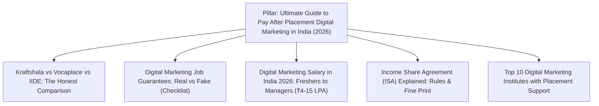
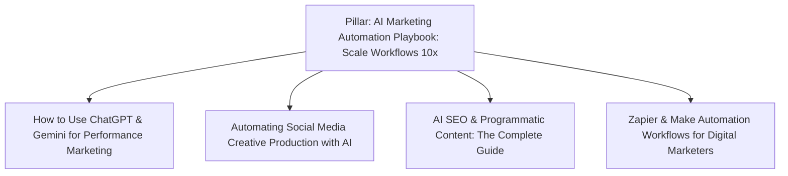
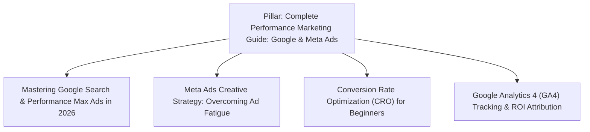

# High-Converting Content Strategy & Competitive Research: vocaplace.com

**Property:** [https://vocaplace.com](https://vocaplace.com)  
**Strategy Focus:** High-Intent Organic Lead Generation & AI Citation Dominance  
**Date:** August 23, 2026  
**Auditor/Strategist:** Universal Blog & Content Strategy Suite  

---

## 1. Executive Summary

This content research and blog strategy is engineered to transform the **vocaplace.com** blog into a predictable, high-volume student acquisition engine. Rather than producing generic top-of-funnel fluff (e.g. "What is Digital Marketing?"), this strategy targets **high-commercial intent** keywords where users are actively evaluating courses, comparing institutes, and looking for guaranteed placement outcomes.

By pairing **first-hand pedagogical authority (Wajed Sk's 20+ years experience)** with **transparent outcome data (₹4–8 LPA salary anchor, 100% job guarantee, pay after placement)**, Vocaplace will outrank traditional institutes (IIDE, UpGrad, Simplilearn) on Google Search and dominate AI citations on ChatGPT Search, Perplexity, and Google AI Overviews.

---

## 2. Competitor Teardown & Vulnerability Analysis

| Competitor | Business & Fee Model | Strengths | Vulnerabilities & Gaps for Vocaplace to Exploit |
|---|---|---|---|
| **Kraftshala** | Upfront fee + Placement refund policy (8X Impact track has selective criteria) | High brand recognition, strong placement marketing | • Complex refund fine-print (long 15-month waiting window, ₹4.5 LPA floor) • High upfront fees for general cohorts • Lacks dedicated AI marketing automation specialization |
| **IIDE** | High upfront tuition (₹1,00,000+) | Strong university partnerships, offline centers in Mumbai/Delhi | • **No Pay After Placement model** (100% upfront fees) • High student churn and negative sentiment around tuition fees • Curriculum is often slow to integrate modern AI tool stacks |
| **UpGrad / Simplilearn** | High upfront tuition (₹60,000 – ₹1,50,000) | Huge domain authority, massive ad budgets | • Mass-market "diploma mill" reputation • Low personalized mentorship (pre-recorded lectures, minimal live feedback) • Poor placement accountability for freshers |

### 🎯 Key Gaps Where Vocaplace Wins:
1. **The Pure Pay-After-Placement Advantage:** Competitors demand ₹50k–₹1.5L upfront with only "placement assistance". Vocaplace offers **100% placement-backed alignment**.
2. **AI Marketing Automation First:** Competitors still teach traditional 2018–2022 marketing basics. Vocaplace integrates AI agents, programmatic workflows, and automation from day one.
3. **Direct Victoria University Mentor Access:** Students learn directly from Wajed Sk (20+ years experience, Victoria University faculty), not junior teaching assistants.

---

## 3. High-Converting Target Audience Personas

### Persona A: The Frustrated College Fresher
- **Demographics:** Age 21–24, recent graduate (BBA, B.Com, BA, B.Tech), living in Tier-1/Tier-2 Indian cities.
- **Pain Point:** Unemployed or stuck in ₹15k–₹20k/month customer support/BPO jobs with no career trajectory.
- **Search Queries:** *"Digital marketing course with 100% placement guarantee India"*, *"Pay after placement courses for freshers"*, *"Digital marketing starting salary in India 2026"*.
- **Conversion Trigger:** ₹4–8 LPA salary anchor, Pay After Placement before placement, quick 120-day timeline.

### Persona B: The Ambitious Career Switcher
- **Demographics:** Age 24–29, working in traditional sales, operations, or non-tech jobs.
- **Pain Point:** Stagnant salary growth, fear of losing money to scammy edtech courses.
- **Search Queries:** *"How to switch career to digital marketing"*, *"Best online digital marketing course for working professionals"*, *"Kraftshala review vs pay after placement"*.
- **Conversion Trigger:** Weekend/evening hybrid schedule, 1-on-1 mentorship, live campaign portfolio.

---

## 4. Four High-ROI Topic Clusters (Hub & Spoke Architecture)

### 🧱 Cluster 1: Pay After Placement & Career Assurance (Direct Lead Gen - BOFU)
*Targeting users at the final decision stage who are ready to enroll.*

| Piece | Type | Target Primary Keyword | Search Intent | CTA / Lead Magnet |
|---|:---:|---|:---:|---|
| **Pillar** | Pillar Page | `pay after placement digital marketing course India` | Commercial High | "Apply for Next Batch (Pay After Placement)" |
| **Spoke 1** | Comparison | `kraftshala marketing launchpad review vs alternatives` | High Intent | "Download Course Comparison Matrix" |
| **Spoke 2** | Guide | `digital marketing course 100 job guarantee real or fake` | High Intent | "Book Free Eligibility Check" |
| **Spoke 3** | Data/Report | `digital marketing salary in India freshers 2026` | Commercial | "Download 2026 Placement Report PDF" |
| **Spoke 4** | FAQ Guide | `income share agreement digital marketing course` | Informational | "Talk to Admissions Counselor" |

---

### 🤖 Cluster 2: AI Marketing Automation (Topical Authority & Differentiation - MOFU)
*Targeting forward-thinking learners who want modern AI skills.*

| Piece | Type | Target Primary Keyword | Search Intent | CTA / Lead Magnet |
|---|:---:|---|:---:|---|
| **Pillar** | Pillar Page | `AI marketing automation course India` | Commercial | "Explore AI Modules & Download Syllabus" |
| **Spoke 1** | How-To | `how to use AI for performance marketing ads` | Informational | "Watch Live AI Demo Class" |
| **Spoke 2** | Tutorial | `AI tools for social media content creation 2026` | Informational | "Download Free Prompt Library" |
| **Spoke 3** | Case Study | `programmatic SEO with AI workflows` | Commercial | "Enroll in 120-Day Mastery Program" |

---

### 📈 Cluster 3: Performance Marketing & Ad Scaling (High Salary Intent - MOFU)
*Targeting students looking to specialize in paid campaigns and analytics.*

| Piece | Type | Target Primary Keyword | Search Intent | CTA / Lead Magnet |
|---|:---:|---|:---:|---|
| **Pillar** | Pillar Page | `performance marketing course with placement` | Commercial High | "Apply for Performance Marketing Cohort" |
| **Spoke 1** | Tutorial | `Google Ads high intent bidding strategies` | Informational | "Download Live Campaign Checklist" |
| **Spoke 2** | Guide | `Meta ads audience targeting and creative testing` | Informational | "Join Next Free Masterclass" |
| **Spoke 3** | Guide | `Conversion Rate Optimization frameworks` | Informational | "Talk to Admissions Counselor" |

---

### 📍 Cluster 4: Localized Career & City Job Hubs (High Local Intent)
*Targeting metropolitan job seekers searching in their local tech hubs.*

| Article Title | Primary Keyword | Search Intent |
|---|---|:---:|
| `Digital Marketing Jobs & Salary in Bangalore: 2026 Guide` | `digital marketing course in bangalore with placement` | High Local |
| `Top Digital Marketing Agencies Hiring Freshers in Delhi NCR` | `digital marketing course in delhi with placement` | High Local |
| `How to Land a ₹6 LPA Digital Marketing Job in Hyderabad & Pune` | `digital marketing course in hyderabad placement` | High Local |
| `Remote Digital Marketing Jobs in India: How to Earn in USD/INR` | `remote digital marketing jobs India freshers` | High Intent |

---

## 5. Lead Capture & Conversion Engine

Every blog post will feature 3 calibrated conversion zones:
1. **Key Takeaways Box (Top 20%):** Quick summary + subtle CTA banner (*"Want to learn this hands-on? Check our Pay After Placement program"*).
2. **Inline Value Offer (Middle 50%):** Downloadable asset (e.g. *Free 2026 Salary Report & Syllabus PDF* in exchange for Name + Phone + Email).
3. **Sticky Bottom Bar / Bottom CTA (End of Post):** Direct application form trigger (*"Limited seats for next Monday batch — 100% Job Guarantee. Apply Now →"*).

---

## 6. 90-Day Execution Roadmap

- **Month 1 (Immediate Lead Generation):** Publish Cluster 1 (Pay After Placement Hub, Comparison Guide, Salary Breakdown).
- **Month 2 (Topical Authority & AI Differentiation):** Publish Cluster 2 (AI Marketing Automation, Prompt Frameworks, Programmatic SEO).
- **Month 3 (Local Scale & Scaling ROAS):** Publish Cluster 3 & Cluster 4 (City-specific hiring guides and performance marketing masteries).
